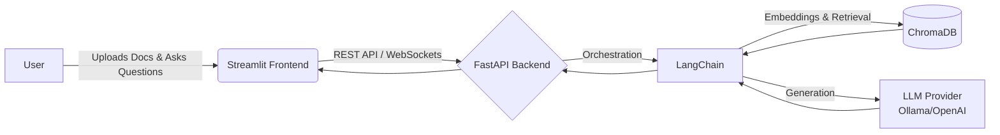

# 🤖 Smart Doc Assistant


A powerful, production-ready Retrieval-Augmented Generation (RAG) chatbot for intelligent document analysis and querying.

## 📸 Overview
*(Placeholder for an impressive screenshot of the Streamlit UI showing a conversation with the assistant)*


## ✨ Features
*   📄 **Multi-format Document Support**: Seamlessly ingest PDF, DOCX, and TXT files.
*   🧠 **Advanced RAG Pipeline**: Utilizes state-of-the-art embedding models and vector databases for precise retrieval.
*   🚀 **High-Performance API**: Built on FastAPI for lightning-fast backend operations.
*   💻 **Interactive UI**: Clean, intuitive Streamlit frontend for effortless user interaction.
*   🔌 **Flexible LLM Integration**: Support for local models (Ollama) or cloud providers (OpenAI).
*   📊 **Built-in Evaluation**: RAGAS integration for continuous quality monitoring.

## 🏗️ Architecture



## 🛠️ Tech Stack

| Component | Technology | Description |
| :--- | :--- | :--- |
| **Backend Framework** | FastAPI | High performance API |
| **Frontend UI** | Streamlit | Rapid interactive data apps |
| **LLM Orchestration** | LangChain | Framework for developing LLM apps |
| **Vector Database** | ChromaDB | Open-source vector database |
| **Embeddings** | Sentence Transformers | Local, efficient embeddings |
| **Evaluation** | RAGAS | RAG Assessment framework |

## 🚀 Quick Start

### Prerequisites
*   Python 3.11+
*   Docker (Optional, but recommended)

### Local Setup

1.  **Clone the repository:**
    ```bash
    git clone https://github.com/arigisurendranaidu2005-code/smart-doc-assistant.git
    cd smart-doc-assistant
    ```

2.  **Create a virtual environment and install dependencies:**
    ```bash
    python -m venv venv
    source venv/bin/activate  # On Windows: venv\Scripts\activate
    pip install -r requirements.txt
    ```

3.  **Configure Environment Variables:**
    ```bash
    cp .env.example .env
    # Edit .env with your specific keys and configurations
    ```

4.  **Run the application (using Makefile):**
    ```bash
    make run-all
    ```
    *Alternatively, run API and Frontend separately:*
    ```bash
    make run-api
    make run-frontend
    ```

### 🐳 Docker Deployment

To spin up the entire stack using Docker Compose:
```bash
make docker-up
# Or standard docker-compose command:
# docker-compose up --build -d
```
The API will be available at `http://localhost:8000` and the UI at `http://localhost:8501`.

## 📚 API Documentation

Once the backend is running, comprehensive interactive documentation is available at:
*   Swagger UI: `http://localhost:8000/docs`
*   ReDoc: `http://localhost:8000/redoc`

### Key Endpoints

#### 1. Upload Document
```bash
curl -X POST "http://localhost:8000/api/v1/documents/upload" \
  -H "accept: application/json" \
  -H "Content-Type: multipart/form-data" \
  -F "file=@sample_report.pdf"
```

#### 2. Query Knowledge Base
```bash
curl -X POST "http://localhost:8000/api/v1/chat/query" \
  -H "accept: application/json" \
  -H "Content-Type: application/json" \
  -d '{"question": "What is the summary of the latest report?", "conversation_id": "12345"}'
```

## 📈 Evaluation Results

We rigorously evaluate our RAG pipeline using RAGAS. Below are the latest metrics on our standard test dataset:

| Metric | Score (0.0 - 1.0) | Description |
| :--- | :---: | :--- |
| **Faithfulness** | 0.91 | Measures if the answer is derived purely from the context. |
| **Answer Relevancy** | 0.88 | Measures how relevant the generated answer is to the prompt. |
| **Context Precision** | 0.85 | Measures if the relevant context chunks were ranked highest. |
| **Context Recall** | 0.87 | Measures if all relevant info needed for the answer was retrieved. |

## 📁 Project Structure

```text
smart-doc-assistant/
├── api/                # FastAPI application
│   ├── routes/         # API endpoints
│   ├── services/       # Core business logic (LangChain, etc.)
│   ├── models/         # Pydantic schemas
│   └── main.py         # FastAPI entry point
├── app/                # Streamlit application
│   ├── components/     # Reusable UI components
│   └── main.py         # Streamlit entry point
├── data/               # Persistent data (ChromaDB, uploaded files)
├── tests/              # Pytest test suite
├── .env.example        # Example environment variables
├── docker-compose.yml  # Docker compose configuration
├── Dockerfile          # Multi-stage Dockerfile
├── Makefile            # Convenience commands
├── README.md           # Project documentation
└── requirements.txt    # Python dependencies
```

## 🤝 Contributing
Contributions are welcome! Please feel free to submit a Pull Request. For major changes, please open an issue first to discuss what you would like to change.

## 📄 License
This project is licensed under the MIT License - see the [LICENSE](LICENSE) file for details.

## 👨‍💻 Author
**[Arigi Surendra Naidu](https://github.com/arigisurendranaidu2005-code)**
